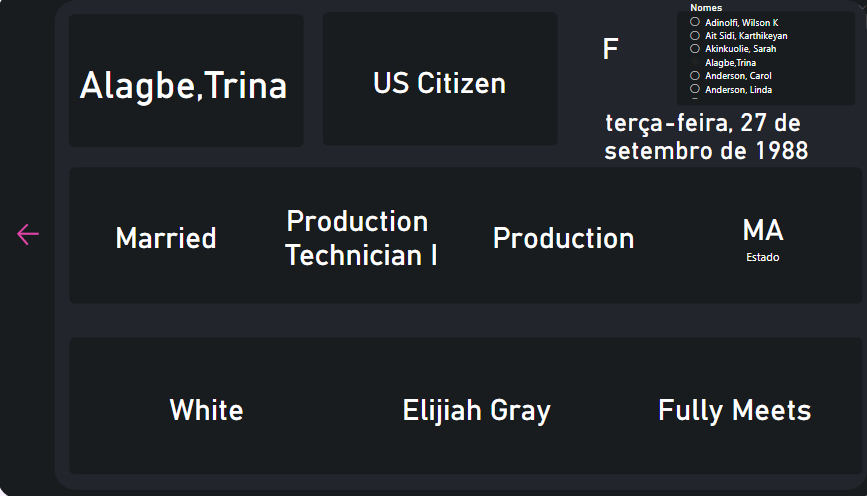

# Análise de Net Promoter Score (NPS) e Recursos Humanos (RH)

Neste repositório possui dashboards em Power BI com algumas análises e métricas que fiz para estudo:

## NPS

Foi feito baseado no enunciado da planilha, na qual é pedido para analisar as lojas com média de 7, além de que é preciso verificar os principais indicadores como atendimento por filial/franquia; desempenho por filial/franquia; melhor desempenho entre filial/franquia.

## Dashboard Recursos Humanos

Foi feito baseado no enunciado da planilha, na qual é pedido para identificar o maior número de faltas, o maior gasto entre as filiais, média de idade, soma dos salários, faltas por departamento, média de gastos por filial, total de despesas por área.

## Dashboard Recursos Humanos 2 - Simples

Esse dashboard foi feito baseado de uma planilha americana

